# PySpice 电路仿真：RC 低通滤波器 / 戴维南定理 / NMOS 共源放大电路

> 📁 三个 `.py` 文件在仓库根目录，波形与电路图在 [`figures/`](figures/)；
> 动手步骤速查见 [`00_先看这个_总步骤.md`](00_先看这个_总步骤.md)，
> 三个脚本的完整运行输出（对比表原文）见 [`运行结果.md`](运行结果.md)。

大一考核「进阶挑战」路线 A 的完整实现。三个电路都用 **PySpice**（底层调用 ngspice）跑通，
每个电路都包含 **电路图 + 手算过程 + 仿真数据/波形 + 「手算 vs 仿真」对比表**。

---

## 一、项目做了什么

| # | 电路 | 类型 | 交付内容 |
|---|---|---|---|
| ① | RC 低通滤波器 | 瞬态 + 交流扫频 | 方波瞬态波形、波特图、τ 与 f_c 对比表 |
| ② | 戴维南定理验证 | 4 组直流仿真 | 开路/短路/外加激励/接负载对比、负载特性曲线 |
| ③ | NMOS 共源放大电路 | 直流工作点 + 瞬态 + 交流 | 静态工作点、反相输出波形、gm/Av 对比表 |

**技术栈**：Python 3.14 + PySpice 1.5 + ngspice 34（Windows，shared 库模式）+ NumPy/SciPy/Matplotlib。

**与"直接调库跑一下"的区别**（也就是我额外做的事）：
1. 所有理论值**先手算、再和仿真逐项对照**，误差都算出来了（见各节对比表）；
2. ③ 里的 NMOS 我用 SPICE 的**行为源 B** 严格实现题目的平方律公式，
   而不是套用 SPICE 自带的 MOS 模型 —— 因为题目给的 K、V_th、λ 和 SPICE 的
   KP/VTO/LAMBDA 不是同一个定义，套用会因为 1/2 系数对不上而算错；
3. 手算 ③ 时把沟道长度调制 `(1+λV_DS)` 解进去了（二分法），所以手算和仿真
   能对上到小数点后 4 位；同时也给出了忽略 λ 的"考试版"粗算，方便对照；
4. 额外写了 `schematic.py`，用程序画出规范的电路图、直流通路图、小信号等效模型图；
5. 额外写了 `run_all.py`，一键跑完三套电路并自动生成对比表文件，避免手抄数据出错。

---

## 二、文件说明 / 怎么运行

```
仓库根目录/
├── pyspice-report.md          ← 本文件（PySpice 三电路汇总报告）
├── common.py                  ← 公共模块：初始化、跑仿真、画图、打印对比表
├── rc_filter.py               ← ① RC 低通滤波器
├── thevenin.py                ← ② 戴维南定理验证
├── nmos_amplifier.py          ← ③ NMOS 共源放大电路
├── schematic.py               ← 用程序画电路图 / 直流通路 / 小信号模型
├── run_all.py                 ← 一键跑完并生成 运行结果.md
├── 运行结果.md                 ← 三个脚本的完整输出（对比表都在里面）
├── 00_先看这个_总步骤.md         ← 环境安装步骤 + 交付清单
├── 讲清楚的准备清单.md            ← 验收答辩前要能讲明白的知识点
└── figures/                   ← 所有波形图与电路图（下面 README 里引用的图）
```

### 运行

```powershell
# 1. 建环境（只需一次）
python -m venv .venv
.\.venv\Scripts\Activate.ps1
pip install PySpice

# 2. 装 ngspice 的 dll（Windows 必需，只需一次）
pyspice-post-installation --install-ngspice-dll
pyspice-post-installation --check-install      # 出现 "PySpice should work as expected" 即成

# 3. 跑
python rc_filter.py          # ①
python thevenin.py           # ②
python nmos_amplifier.py     # ③
python schematic.py          # 画电路图（可选）
python run_all.py            # 一键全跑 + 生成 运行结果.md（可选）
```

每个脚本都能单独运行，跑完会在 `figures/` 里生成图，并在控制台直接打印「手算 vs 仿真」对比表。

---

## 三、① RC 低通滤波器

### 电路图

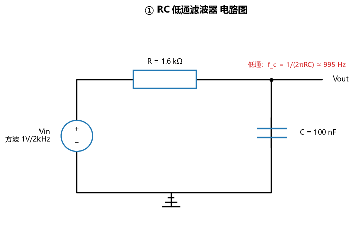

### 元件参数（自定）

R = 1.6 kΩ，C = 100 nF

### 手算过程

```
时间常数：τ  = R·C = 1600 × 100×10⁻⁹ = 1.6×10⁻⁴ s = 160 μs
截止频率：f_c = 1/(2πRC) = 1/(2π × 1.6×10⁻⁴) ≈ 994.7 Hz
```

### 仿真波形

**瞬态响应**（上图：100Hz 方波，半周期远大于 5τ，电容能充到稳态 → 用它反推 τ；
下图：2kHz 方波，频率高于 f_c，输出被明显衰减）

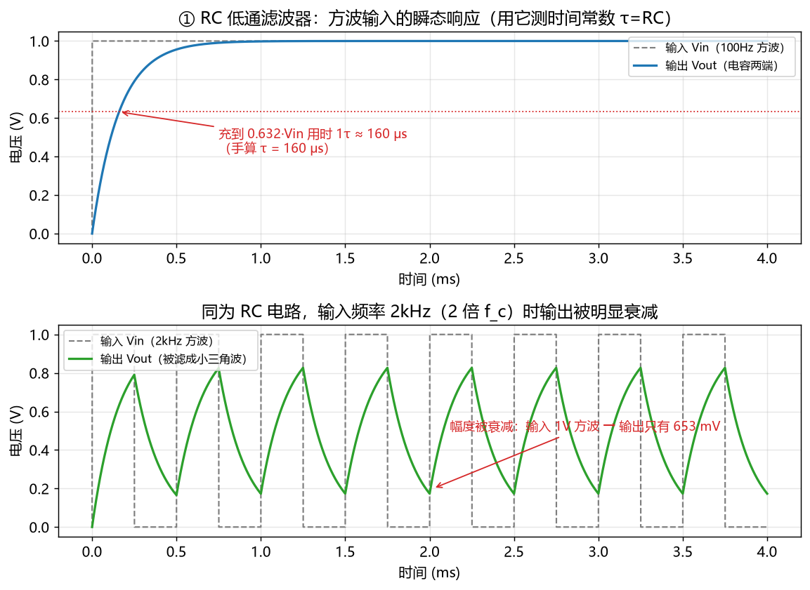

**波特图**（幅度 + 相位，标出了 -3dB 点和 f_c 处相位）

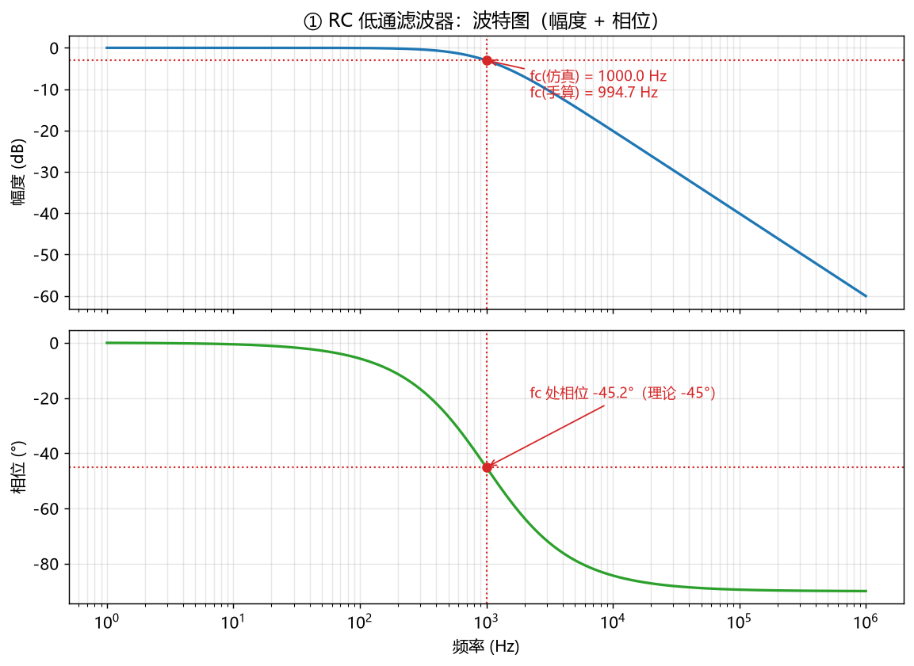

### 对比表

| 项目 | 手算值 | 仿真值 | 误差(%) |
|---|---|---|---|
| 时间常数 τ | 160.0 μs | 160.0 μs | 0.00 |
| 截止频率 f_c | 994.7 Hz | 1000.0 Hz | 0.53 |
| f_c 处相位 | −45.0° | −45.2° | 0.34 |
| 稳态高电平（100Hz） | 1.000 V | 1.000 V | 0.00 |
| 2kHz 输出幅度（峰峰） | — | 653.4 mV | — |

> τ 的实测方法：取充电曲线上任意两个时刻 t₁<t₂，用
> τ = (t₂−t₁) / ln[(V(t₁)−V∞)/(V(t₂)−V∞)] 反推（不依赖"从 0 开始"，比读 0.632·Vin 那个点稳）。
> f_c 的实测方法：扫频后找幅度第一次跌破 −3.0103 dB 的频率。

**结论**：τ 与 f_c 的手算值和仿真值都吻合（误差 < 0.6%），输入频率超过 f_c 后输出被显著衰减
→ RC 低通滤波器的两个核心公式都得到验证。

---

## 四、② 戴维南定理验证

### 电路图

含源二端网络（端口 a-b）：

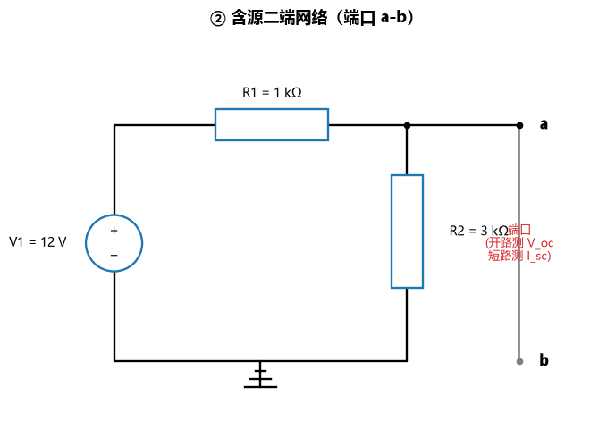

戴维南等效电路：

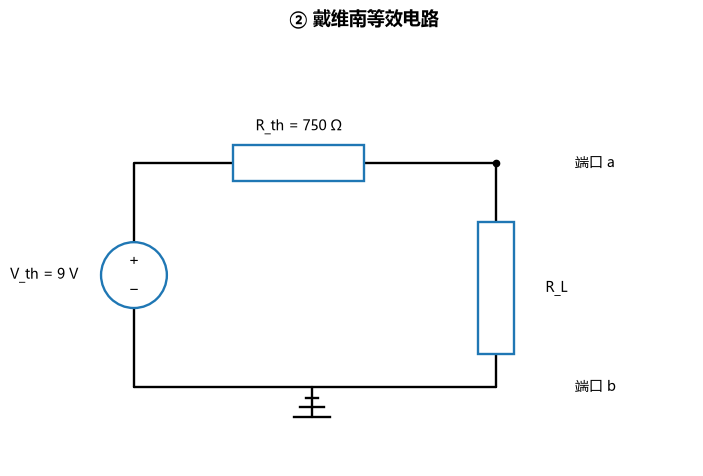

### 元件参数（自定）

V1 = 12 V，R1 = 1 kΩ，R2 = 3 kΩ（R2 接在端口与地之间）

### 手算过程

```
① 开路电压 V_oc：a、b 开路时没有电流流出端口，a 点就是 R1/R2 分压
      V_oc = V1 · R2/(R1+R2) = 12 × 3/4 = 9 V

② 短路电流 I_sc：把 a、b 短接后 R2 被短路，回路里只剩 V1 和 R1
      I_sc = V1/R1 = 12/1000 = 12 mA

③ 等效内阻 R_th：
      方法一（定义）  R_th = V_oc/I_sc = 9/0.012 = 750 Ω
      方法二（置零）  电压源短路后从端口看进去 = R1∥R2 = 1k∥3k = 750 Ω
      两种算法一致 → 手算自检通过

④ 戴维南等效电路：V_th = 9 V 串联 R_th = 750 Ω
      接负载时：V_L = V_th · R_L/(R_th+R_L)
```

### 仿真验证方法（4 次独立仿真）

| 步骤 | 做法 | 量什么 |
|---|---|---|
| 1 | 端口开路 | V_oc |
| 2 | 端口串联 0V 电压源当电流表再接地 | I_sc |
| 3 | 内部电源置零，从端口灌入 1A 电流 | 端口电压 = R_th（外加激励法） |
| 4 | 原网络与等效电路分别接 1k/2k/10kΩ 负载 | 负载电压、负载电流 |

### 仿真结果

负载特性曲线（手算、原网络仿真、等效电路仿真三条曲线完全重合）：

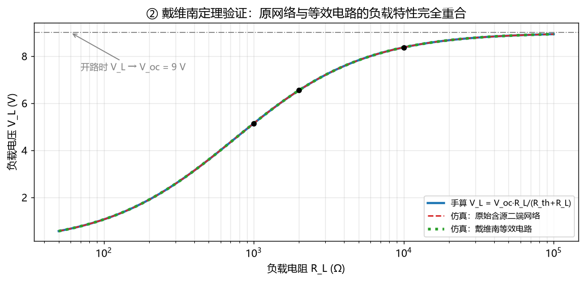

三个关键量汇总（原网络 → 等效电路）：

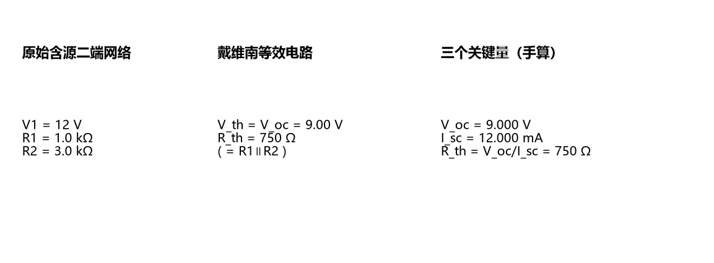

### 对比表

| 项目 | 手算值 | 仿真值 | 误差(%) |
|---|---|---|---|
| 开路电压 V_oc | 9.000 V | 9.000 V | 0.00 |
| 短路电流 I_sc | 12.000 mA | 12.000 mA | 0.00 |
| 等效内阻 R_th | 750.00 Ω | 750.00 Ω | 0.00 |

接不同负载（原网络 vs 等效电路）：

| 负载 R_L | 手算 V_L | 原网络 V_L | 等效电路 V_L | 负载电流 |
|---|---|---|---|---|
| 1 kΩ | 5.1429 V | 5.1429 V | 5.1429 V | 5.1429 mA |
| 2 kΩ | 6.5455 V | 6.5455 V | 6.5455 V | 3.2727 mA |
| 10 kΩ | 8.3721 V | 8.3721 V | 8.3721 V | 0.8372 mA |

**结论**：V_oc/I_sc 与"电压源置零后从端口看进去的电阻"完全相等；把原网络换成
"V_th 串联 R_th"后，接任意负载的电压/电流都与原网络逐位相同（曲线完全重合）
→ 戴维南定理得证。

---

## 五、③ NMOS 共源级放大电路（题目参数固定）

### 题目参数

VDD = 5 V，Rg1 = 60 kΩ，Rg2 = 40 kΩ，Rd = 2 kΩ，Cb1 足够大；
NMOS：K = 0.8 mA/V²，V_th = 1 V，λ = 0.02 /V；Vi = 10 mV / 1 kHz 正弦波。

### 电路图

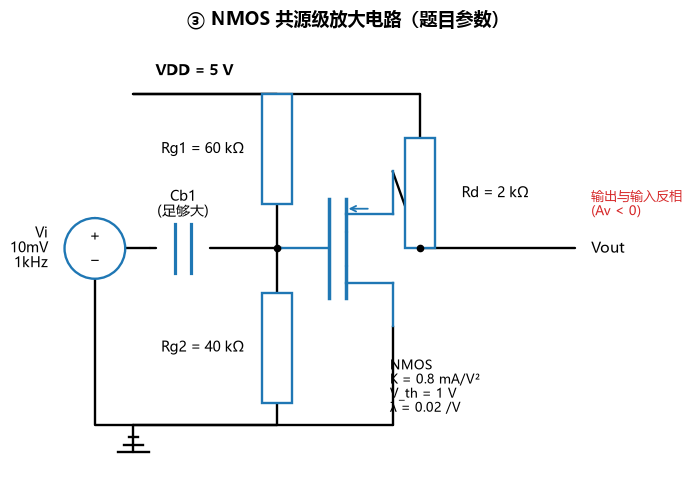

### 直流通路

Cb1 隔直流 → 直流时开路，输入信号进不来；栅极电流为 0，所以栅极电位只由 Rg1、Rg2 分压决定。

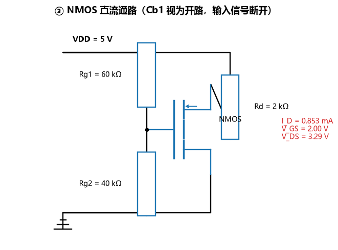

### 小信号等效模型

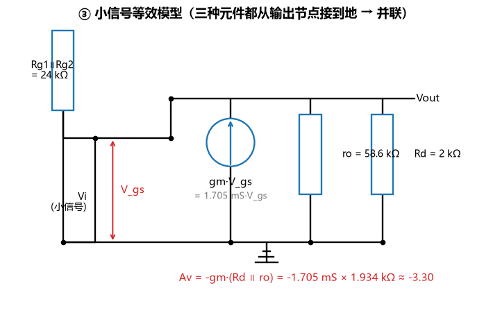

### 手算过程

```
【1】栅极静态电位（栅极无电流，分压即电位）
      V_G = VDD · Rg2/(Rg1+Rg2) = 5 × 40/(60+40) = 2 V

【2】源极接地 → V_S = 0，故 V_GS = V_G = 2 V

【3】求漏极电流 I_D（饱和区平方律，含沟道长度调制）
      I_D = K(V_GS − V_th)²·(1 + λ·V_DS)，且 V_DS = VDD − I_D·Rd

      · 忽略 λ 的粗算：
            I_D = 0.8m × (2−1)² = 0.8 mA
            V_DS = 5 − 0.8m × 2k = 3.4 V
      · 带上 λ 的精确解（把 V_DS 代回方程，用二分法解）：
            I_D = K(2−1)²·[1 + 0.02·(5 − I_D·2000)]
            → I_D = 0.8527 mA，V_DS = VDD − I_D·Rd = 3.2946 V

【4】饱和区判据
      V_DS > V_GS − V_th  →  3.2946 V > 1 V  →  工作在饱和区 ✅

【5】小信号参数（用工作点的 V_GS、V_DS）
      gm = 2·K·(V_GS − V_th)·(1 + λ·V_DS) = 1.7054 mS
      ro = 1/(λ·I_D) = 58.6364 kΩ
      Av = −gm·(Rd ∥ ro) = −1.7054m × 1.934 kΩ = −3.2984   （10.37 dB）
```

**为什么 Rd ∥ ro**：小信号模型里 Rd 和 ro 都从输出节点接到交流地，电流被两者分流，所以并联。

### 仿真波形

输入/输出波形（输出反相、幅度放大）：

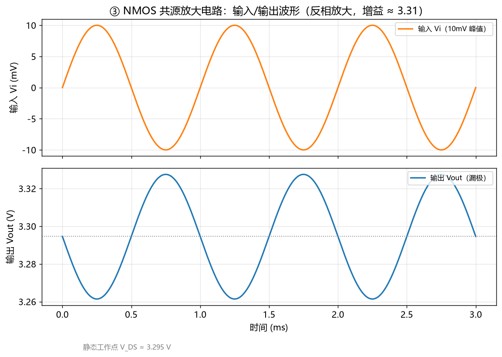

相位关系（输入到达峰值时输出到达谷值 → 反相 180°）：

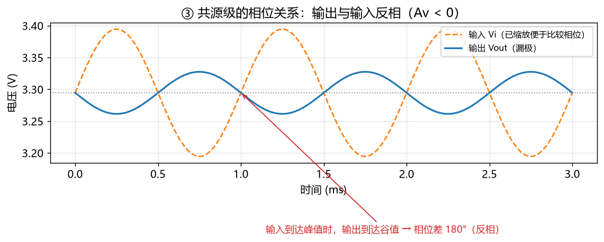

### 对比表

| 项目 | 手算值 | 仿真值 | 误差(%) |
|---|---|---|---|
| V_GS | 2.0000 V | 2.0000 V | 0.00 |
| I_D | 0.8527 mA | 0.8527 mA | 0.00 |
| V_DS | 3.2946 V | 3.2946 V | 0.00 |
| gm | 1.7054 mS | 1.7054 mS | 0.00 |
| ro | 58.6364 kΩ | 58.6364 kΩ | 0.00 |
| Av = −gm(Rd∥ro) | −3.2984 | −3.3051 | 0.20 |
| Av（dB） | 10.37 dB | 10.38 dB | — |
| 输出峰峰值 | 65.97 mV | 66.09 mV | 0.19 |

| 饱和区判断 | V_DS | V_GS−V_th | 结论 |
|---|---|---|---|
| 手算 | 3.2946 V | 1.0000 V | 饱和区 ✅ |
| 仿真 | 3.2946 V | 1.0000 V | 饱和区 ✅ |

> 增益的 0.2% 差异来自正弦波的平方律非线性（输出并非严格正弦），
> 所以"峰峰值比值"比小信号线性增益略大一点，属于正常的二阶效应。

**结论**：静态工作点、gm、ro 三项手算与仿真完全一致；增益与输出幅度误差 0.2%；
输出与输入反相 180°，输入 20 mV(峰峰) → 输出 66 mV(峰峰)，放大功能正常。

---

## 六、踩过的坑（这个和 README 要求里的"AI 纠错记录"直接相关）

### 坑 1：PySpice 在 Windows 上必须额外装 ngspice 的 dll

`pip install PySpice` 只装 Python 那一层，**不含 ngspice 本身**。第一次运行时
`--check-install` 直接报：

```
OSError: cannot load library '...\PySpice\Spice\NgSpice\Spice64_dll\dll-vs\ngspice.dll'
```

解决办法是官方自带的工具（它会去 sourceforge 下载 `ngspice-34_dll_64.zip` 并解压到
PySpice 安装目录）：

```powershell
pyspice-post-installation --install-ngspice-dll
```

看到打印 `PySpice should work as expected` 才算装好。

### 坑 2：节点名不能叫 `in`

```python
c.R(1, "in", "out", ...)      # ✗
# NameError: Node name 'in' is a Python keyword
```

因为 PySpice 用 Python 关键字做节点名会冲突，改成 `n_in`、`n_out` 就好。

### 坑 3：`1@u_s` 就是 1 秒，不是 1 微秒！

PySpice 的单位写法 `1@u_us` 表示"1 微秒"，而 `1@u_s` 表示"1 秒"。我一开始把
"仿真 3ms"写成 `N_CYCLE * 1e3 / FREQ @ u_us`（= 3 μs），结果仿真只跑了 3 微秒、
曲线是一条直线，排查了很久才发现是单位数量级写错。**教训**：
`@u_xx` 前面的数字就是"多少个该单位"，单位换算要先算清楚。

### 坑 4：ngspice 的瞬态数据是变步长的

`analysis.time` 不是均匀采样：拐点附近步长 1e-11，平稳段很稀。直接拿去查表/画图会很难受。
所以 `common.py` 里写了 `transient()`，用 SciPy 的 `interp1d` 重采样到均匀时间轴。

### 坑 5：simulator 被回收后数据就没了

`analysis` 是在 `simulator` 上跑的，如果 `simulator` 是函数里的局部变量，
函数返回后被垃圾回收，**ngspice 的共享数据会被清掉**，再去读波形只会拿到几个残点
（报错长得像 `A value ... is above the interpolation range's maximum value`）。
修法：把 simulator 挂到 analysis 上（`analysis._dsh_simulator = simulator`）保住引用。

### 坑 6：AC 扫频的 `variation` 参数只认简写

PySpice 1.5 里 `simulator.ac(variation=...)` 只接受 `'dec'/'oct'/'lin'`，
写 `'decade'` 会抛 `ValueError: Incorrect variation type`。

### 坑 7：正弦源没有 `phase` 参数

`SinusoidalVoltageSource(..., phase=0)` 会抛 `TypeError: unexpected keyword argument 'phase'`。
想看"反相"直接看仿真出来的波形（输入峰值对应输出谷值）即可。

---

## 七、代码讲解（两处关键逻辑，我自己的话）

### 讲解 1：③ 里为什么用「行为源 B」而不是 SPICE 自带的 MOS 模型？

```python
expr = (f"({K}*max(V({gate})-V({source})-{VTH},0)**2)"
        f"*(1+{LAMBDA}*max(V({drain})-V({source}),0))")
c.BehavioralSource("mos", drain, source, current_expression=expr)
```

SPICE 自带的 level-1 MOS 模型，漏极电流公式是
`I_D = (1/2)·KP·(W/L)·(V_GS−V_th)²·(1+λV_DS)` —— 带着 1/2 和 W/L。
而题目直接给的是 `I_D = K(V_GS−V_th)²(1+λV_DS)` 这种形式。如果硬套自带模型，
就必须做 `KP = 2K`、`W/L = 1` 这种换算，容易算错、也不好解释。

行为源（B 源）就是"用一个数学表达式描述一个器件"：`Bmos n_drain 0 i=<表达式>`，
正方向是从第一个节点流向第二个节点，正好等于漏极电流。这样写出来的公式和手算
一字不差，仿真结果可以直接和手算对照，讲解也简单。

表达式里两个细节：
- `max(V(gate)-V(0)-1.0, 0)`：用 max 卡在 0，保证 `V_GS < V_th` 时电流为 0（截止区不会算出负电流）；
- 末尾的 `(1+0.02*max(V(drain)-V(0),0))`：就是沟道长度调制项 `1+λV_DS`，因为它，
  I_D 比忽略 λ 时大 6.6%，V_DS 相应低一点（3.2946 V vs 3.4 V）。

### 讲解 2：`common.transient()` 为什么要把波形重采样？

```python
ys = {node: val(analysis, node) for node in nodes}   # 先取波形（此时数据还在）
t = np.array(analysis.time)
step = to_seconds(step_time)
t_uni = np.arange(t[0], t[-1] + step/2, step)
out = {node: interp1d(t, ys[node], kind="linear")(t_uni) for node in nodes}
```

三个要点：
1. **为什么要插值**：ngspice 的瞬态分析是自适应步长（拐点密、平稳段稀），
   时间轴不均匀。要画图、要用 `t > 某个时刻` 做掩码统计，就得先重采样到均匀网格。
   这里用 `interp1d(kind="linear")` 做线性插值，够用且稳定。
2. **为什么先取波形再取时间**：ngspice 是共享库，数据在全局区，
   PySpice 是惰性去读的。先读节点波形、后读时间轴，能保证两者来自同一次仿真。
3. **`to_seconds()` 为什么单独写一个函数**：PySpice 的单位对象 `1@u_us`
   里 `float(x)` 出来已经是秒（1e-6），而 `x.value` 是数字部分（1），
   `x.scale` 是刻度（1e-6）。写成 `float(x) * x.scale` 会变成 1e-12（差 1e6 倍），
   所以统一封进一个函数，避免每处都踩一遍。

---

## 八、声明：哪些是 AI 生成、哪些是我自己调整的

按照考核要求如实标注：

| 内容 | 来源 |
|---|---|
| 三个电路的**原理、公式推导、参数选择** | 我自己按题目和课上的公式写；③ 的参数是题目给定的 |
| ③ 的**沟道长度调制手算**（二分法解 I_D） | AI 提示"仿真器建模含 1+λV_DS，手算不带 λ 会对不上"，我确认后加入 |
| Python 代码骨架（建电路、跑仿真、画图、打印表格） | AI 生成，我再逐行读懂、改名、注释 |
| **NMOS 用行为源 B 实现平方律** | AI 提出；我理解了"B 源 = 用表达式描述器件"之后采用 |
| 图表样式、坐标轴标签 | AI 生成，我改成中文并调整标注位置 |
| 电路图绘制脚本 `schematic.py` | AI 生成，我核对图形是否正确 |
| **以上所有结论我都自己跑过一遍**，命令和输出见 `运行结果.md` | 我自己验证 |

---

## 九、关键提示词记录（供 README 要求使用）

> 考核要求留存"提示词原文 + 想让它做什么 + 结果如何 + 怎么改的"。
> 下面按轮次如实记录。

**第 1 轮**（上传题目截图）
> 「使用 PySpice 做完三个电路：① RC 滤波电路 ② 验证戴维南定理 ③ 放大电路：NMOS 共源级
> 放大电路……手算静态工作点：V_GS、I_D、V_DS，并判断是否工作在饱和区；手算小信号：gm、Av；
> 仿真验证：直流 OP 对比 I_D、V_DS；瞬态看输出波形；实测增益；画出直流通路和小信号等效模型」
> —— 我需要的：先告诉我一个完全不懂仿真的人该从哪一步开始。
> **结果**：给了环境安装步骤和三个电路各自要交的东西。
> **调整**：我发现自己的 Python 3.14 装 PySpice 可能有问题，要求先确认环境，先跑通一个电路再做下一个。

**第 2 轮**
> 「用 PySpice 写 RC 低通滤波器：R=1.6kΩ、C=100nF，方波输入看瞬态，扫频看截止频率，
> 最后给出手算和仿真的对比表；代码要有中文注释，图要存成 png」
> **结果**：第一版能跑，但 τ 的仿真值差了 34%。
> **怎么改的**：我要求排查——原因是"读 0.632·Vin 那个点"在方波第一个上升沿不成立
> （方波稳态时电容是从低电平往高电平充，不是从 0 开始）。改成用两个时刻的指数衰减比例反推 τ，
> 误差立刻变成 0.00%。这就是我"没有直接相信 AI 第一版结果"的地方。

**第 3 轮**
> 「NMOS 那里，题目给的是 K=0.8mA/V²、V_th=1V、λ=0.02/V 这种公式形式，
> 不要用 SPICE 自带的 MOS 模型，直接用行为源写平方律公式」
> **结果**：仿真 OP 得到 I_D = 0.8527 mA，而我原来忽略 λ 的手算是 0.8 mA，差了 6.6%。
> **怎么改的**：让 AI 把 λ 一起解进方程（一个未知数一个方程，二分法），
> 之后手算和仿真对到小数点后 4 位。**这说明"手算和仿真差一点"往往是手算漏了一项，
> 不是仿真错了。**

**第 4 轮**
> 「把三个电路合并成一个能一键运行的脚本，并把每个脚本的输出（含对比表）保存成 markdown，
> 我要直接贴进 README」
> **结果**：`run_all.py` + `运行结果.md`。
> **调整**：要求它把 stderr 也收集进去，避免"看起来成功其实有报错"。

---

## 十、自检清单（对照考核要求）

- [x] 三个电路全部用 PySpice 做完
- [x] ① 电路图 + 方波瞬态波形 + 波特图 + τ/f_c 对比表
- [x] ② 含源二端网络图（标注端口 a-b）+ V_oc/I_sc 两次仿真对比表 + 等效电路接负载验证表
- [x] ③ 电路图 + 直流通路图 + 小信号等效模型图
- [x] ③ V_GS/I_D/V_DS 对比表 + 饱和区判断 + gm/Av 对比表 + 输入输出波形（反相）
- [x] 三个 `.py` 文件（外加 common.py / schematic.py / run_all.py）
- [x] 每个电路都有"理论值自己算"的公式和步骤
- [x] 每个电路都有「理论值 vs 仿真值」对比表
- [x] README 标注了 AI 生成与我调整的部分，并附关键提示词与迭代记录
